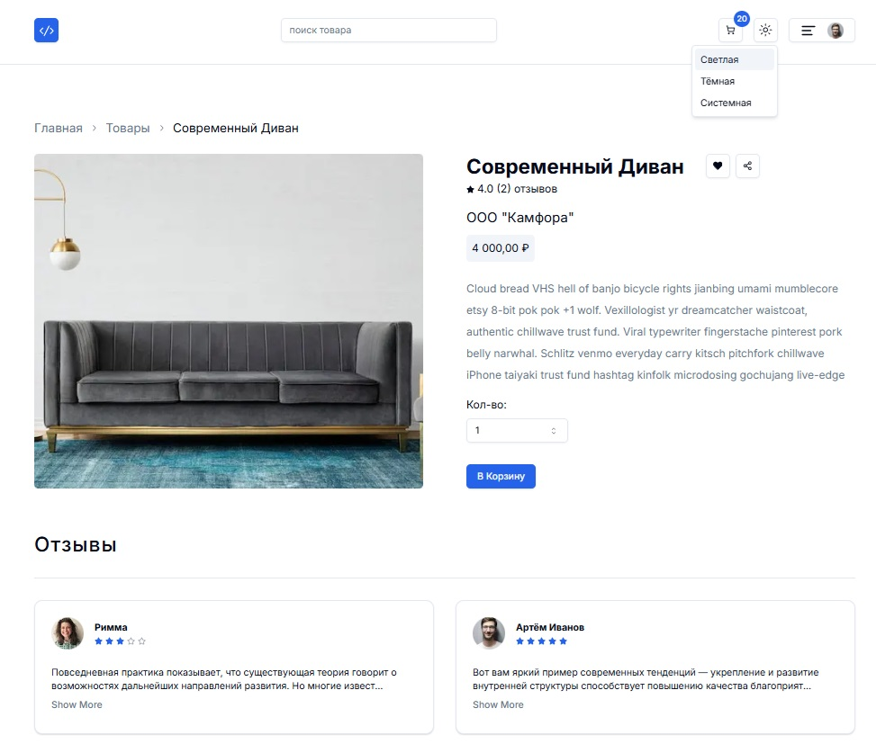
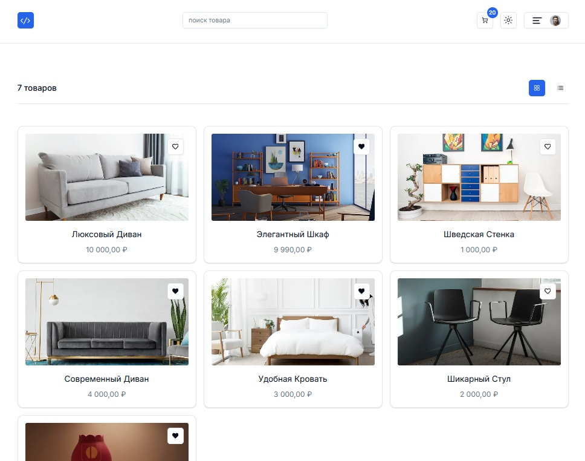
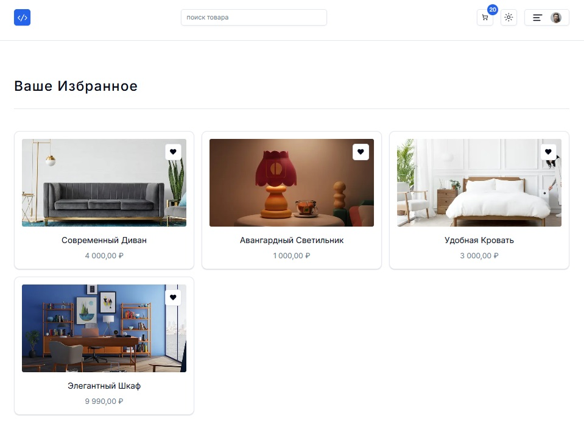
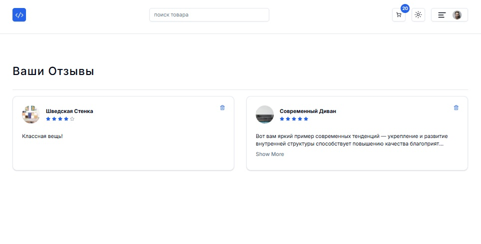
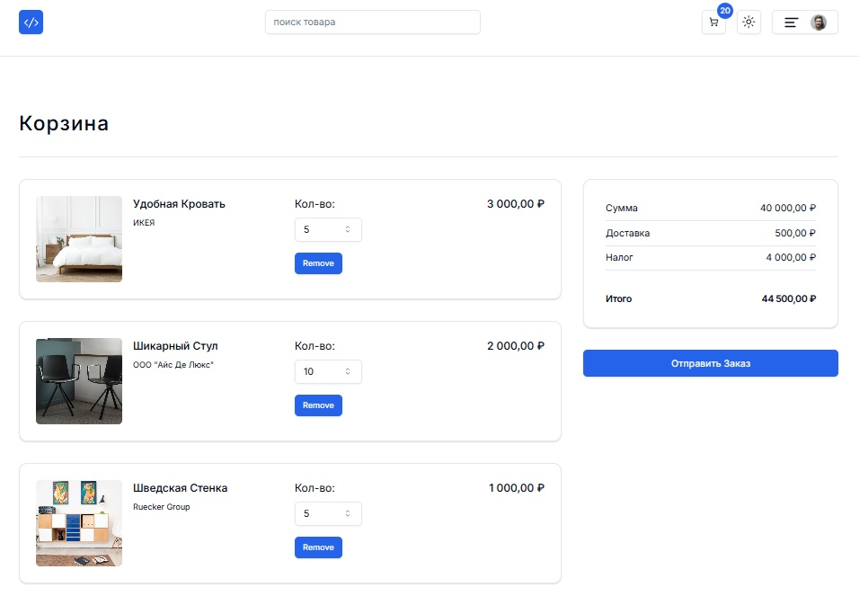
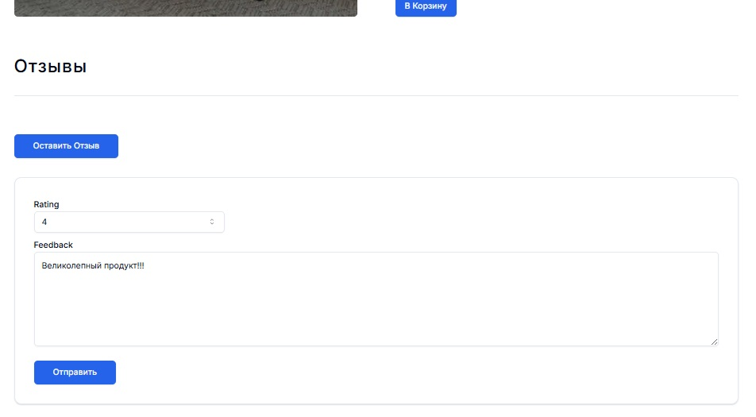
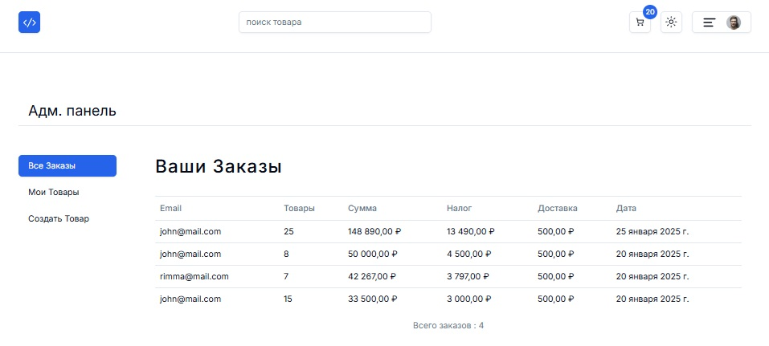
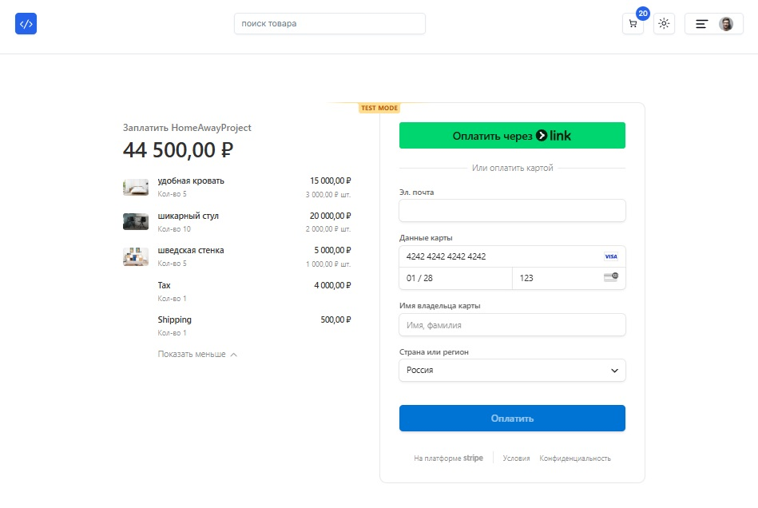

# Fullstack-App - многостраничный интернет-магазин на Next.JS

## Используемые технологии

-   Фреймворк - Next.JS
-   Основной язык - Typescript
-   Библиотека для разработки пользовательских интерфейсов - React
-   Библиотека стилей - Tailwind CSS
-   Библиотека стилевых компонентов - Shadcn UI
-   Облачная база данных - Supabase <https://supabase.com/>
-   Инструментарий для работы с базами данных и ORM - Prisma <https://www.prisma.io/>
-   Сервис аутентификации - Clerk <https://clerk.com/>
-   Сервис проведения онлайн-платежей Stripe <https://stripe.com/> (не работает в РФ, используйте тестовую карту 4242 4242 4242 4242)

### Основное окно магазина

-   логотип
-   диалоговое окно поиска товара
-   иконка корзины с идентификацией кол-ва добавленного товара
-   кнопка динамического переклчения темы (светлая/темная/системная)
-   выпаюадщее меню с иконкой пользователя (если авторизован), с основными разделами магазина
-   карусель
-   раздел "Избранные товары"

### Окно индивидуальной карточки товара

-   Бредкрамбсы
-   Основное фото товара
-   Название товара
-   Кнопка "Добавить в избранное"
-   Кнопка "Отправить в соц. сети"
-   Динамически рассчитытываемый рейтинг товара по отзывам
-   Цена
-   Полное описание
-   Кол-во к заказу
-   Кнопка добавления в текущую корзину
-   Раздел "Отзывы" с иконкой автора, выставленный рейтинг и текст (динамически сворачиваемый)

### Окно общего каталога товаров

-   вывод "сеткой" и "строками"
-   кнопка "Добавить в избранное", оверлеем на фото

### Окно "Избранное"

### Окно "Мои отзывы"

### Окно "Корзина"

-   Изменение кол-ва
-   Удаление
-   Динамический перерасчёт суммы, доставки, налога и итога
-   Кнопка "Отправить заказ" (обработка оплаты в Stripe)

### Диалог "Оставить отзыв о товаре"

### Окно "Админка"

У пользователя-администратора появляется дополнительная панель в меню - административная часть магазина,
куда входит возможности

-   просмотра всех заказов,
-   просмотр всех введенных товаров
-   меню создания нового товара (параметры товара и фото сохраняются в облаке Supabase)

### Оплата заказа через сервис Stripe (не работает в РФ)

### Меню авторизации (сервис Clerk)

### Вариант тёмной темы

